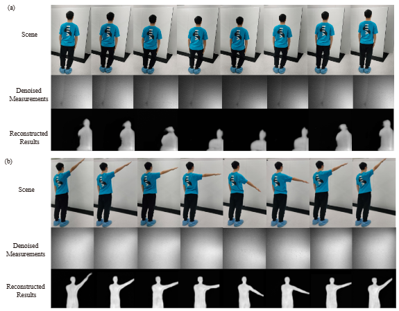
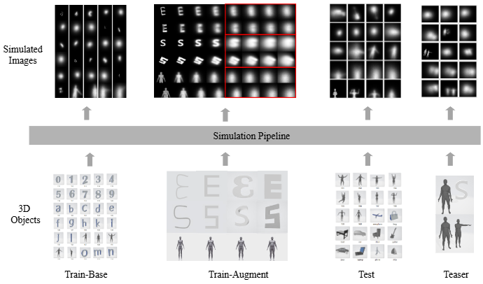
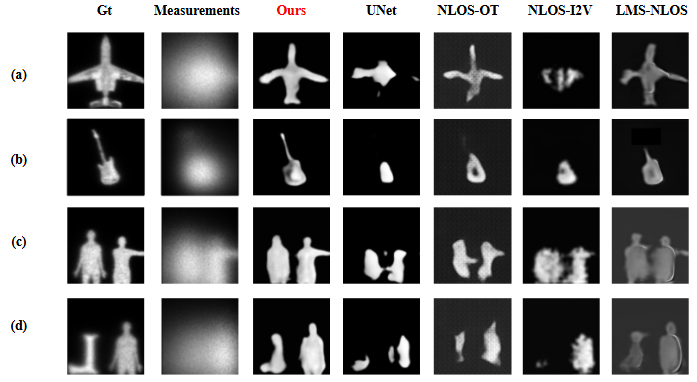
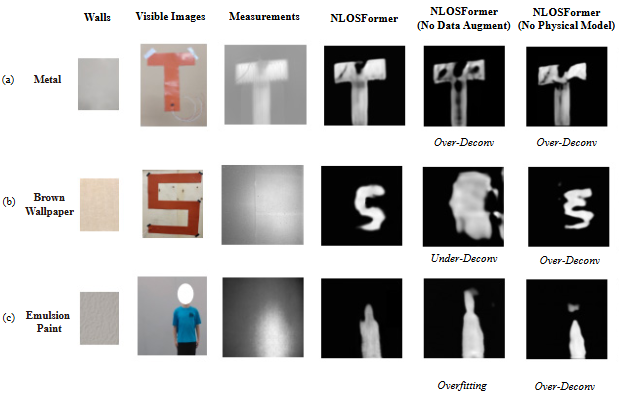

# NLOSFormer

This is the public implementation for "Thermal Non-Line-of-Sight Imaging through Rough Surfaces".

## Install

First, create a new virtual environment.

`conda create -n NLOSFormer python==3.10`

`conda activate NLOSFormer`

Then, install all the packages required.

`pip install -r requirements.txt`

When installing mitsuba, first install pybind11,  `sudo apt-get install pybind11-dev`

## Demo

The pretrained path is placed under "Pth/", and the data are placed under "TestData/squat/".

A demo for thermal NLOS imaging of a dynamic target can be run by `python demo.py`. Then you can see a video of the reconstructed target under "temp_results/".

## Dataset

We provide the ThermalNLOS dataset for thermal NLOS imaging, which consists of four parts: *Train-Base*, *Train-Augment*, *Test*, and *Teaser*. 

*Train-Base* and *Train-Augment* serve as two training sets, with *Train-Augment* incorporating data augmentation techniques. In *Train-Augment*, each mesh is augmented with variants of different widths (from left to right) to mitigate overfitting. *Test* and *Teaser* are two evaluation sets: *Test* contains unseen human figures and daily objects, while *Teaser* comprises complex scenarios with multiple targets.

The whole dataset and pretrained weights can be download from the [link](https://pan.baidu.com/s/1S2v8CIDjwUa8w7nnPkV5xA?pwd=z78v). After downloading the dataset, put the root directory of the dataset in "ThermalNLOS/". There are four subdirectories, "base/", "augment/", "test/" and "teaser".

## Train

We provide the training codes for **NLOSFormer** and other four typical networks, including [UNet](https://arxiv.org/abs/2005.00007), [NLOS-OT](https://github.com/ruixv/NLOS-OT), [NLOS-I2V](https://github.com/codeMakerZWH/NLOS-I2V) and [LMS-NLOS](https://github.com/CS-wpf/LMS-NLOS). Although pretrained weights are given in "Pth/", training codes are also provided to reproduce our experiments.

To train NLOSFormer, you can run 

``python main.py --stage train --model nlosformer --data_path ThermalNLOS/``

For UNet, NLOS-I2V and LMS-NLOS, you can use options `--model UNet/NLOS_I2V/LMSNet`. For NLOS-OT, there are two stages to run, you can follow the instructions  in "train_NLOS_OT.py".

NLOSFormer can also be trained in multiple devices. You can use `accelerate launch main.py --num_processes=4`. UNet, NLOS-I2V and LMS-NLOS are the same as NLOSFormer.

To carry out ablation experiments, we can train NLOSFormer under the following different conditions:

* No data augumentation: `python main.py --stage train --model nlosformer --data_path ThermalNLOS/ --augment False`
* No supervision on the kernel: `python main.py --stage train --data_path ThermalNLOS/ --kernel False`

## Evaluation

We compare **NLOSFormer** with four typical networks for passive NLOS imaging, [UNet](https://arxiv.org/abs/2005.00007), [NLOS-OT](https://github.com/ruixv/NLOS-OT), [NLOS-I2V](https://github.com/codeMakerZWH/NLOS-I2V) and [LMS-NLOS](https://github.com/CS-wpf/LMS-NLOS). We have provided the pretrained weights of these networks in "Pth/" to facilitate comparison.

To evaluate NLOSFormer on images (.mat) under "TestData/sample_data/", you can run

 ``python main.py --stage test --model nlosformer --pth model-augment.pt --data_path TestData/sample_data/``.

For UNet, NLOS-OT, NLOS-I2V and LMS-NLOS, you can use `--model UNet/NLOS_OT/NLOS_I2V/LMSNet`. Three representative results on the TheramalNLOS *Test* and *Teaser* dataset are given below. NLOSFormer achieves significantly clearer and more accurate reconstructions than the baseline networks.

We also provide codes to perform ablation experiments, including:

* No data augmentation: `python main.py --stage test --model nlosformer --pth model-base.pt --data_path TestData/sample_data/`
* No kernel supervision: `python main.py --stage test --kernel False --pth model-augment.pt --data_path TestData/sample_data/`

Through the ablation experiments, we have the following findings:

* When trained without data augmentation and physical modeling, the network exhibits a strong tendency to overfit or fail to reconstruct the target accurately.
* As the proportion of principal components in the PCA increases, the performance also improves until the proportion goes near 1.0.
